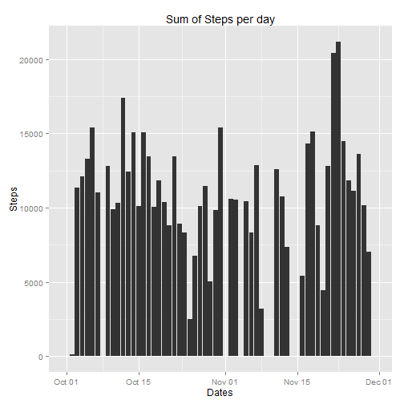
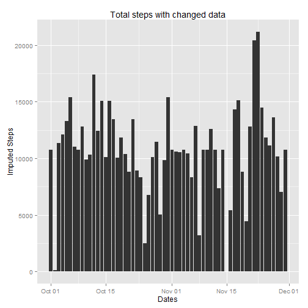
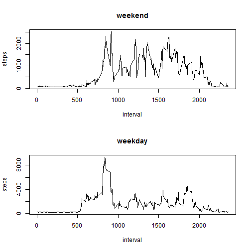

This is an R Markdown document. Markdown is a simple formatting syntax for authoring HTML, PDF, and MS Word documents. For more details on using R Markdown see <http://rmarkdown.rstudio.com>.

When you click the **Knit** button a document will be generated that includes both content as well as the output of any embedded R code chunks within the document. You can embed an R code chunk like this:


```r
# To read the data 
activity <- read.csv("activity.csv") 
# To analyse the given data and process it accordingly. 
dim(activity)
```

```
## [1] 17568     3
```

```r
str(activity)
```

```
## 'data.frame':	17568 obs. of  3 variables:
##  $ steps   : int  NA NA NA NA NA NA NA NA NA NA ...
##  $ date    : Factor w/ 61 levels "2012-10-01","2012-10-02",..: 1 1 1 1 1 1 1 1 1 1 ...
##  $ interval: int  0 5 10 15 20 25 30 35 40 45 ...
```

```r
# to convert the class of date column from 'factor' to 'date'
activity$date <- as.Date(activity$date)

library(dplyr)
```

```
## 
## Attaching package: 'dplyr'
## 
## The following object is masked from 'package:stats':
## 
##     filter
## 
## The following objects are masked from 'package:base':
## 
##     intersect, setdiff, setequal, union
```

```r
library(ggplot2)
grp <- group_by(activity, date)

## calculates the mean , sum and median of total number of steps per day. 
activity_summary <- summarise(grp, mean=mean(steps,na.rm = TRUE),sum=sum(steps), median = median(steps, na.rm = TRUE))
activity_summary <- as.data.frame(activity_summary)

## according to the question, all the NAs have to be ignored. Therefore, replace NA with 0. 
activity_summary[is.na(activity_summary)] <- 0


## calculates the mean and median of the entire data set 
oldMedian <- median(activity_summary$sum)
oldMean <- mean(activity_summary$sum)


# plot a histogram using ggplot 
ggplot(activity_summary, aes(x=date, y=sum))+geom_histogram(stat="identity")+ xlab("Dates")+ ylab("Steps")+ labs(title= "Sum of Steps per day")
```

 

```r
## get the average number of steps taken across all intervals - Average daily activity pattern. 
avg_daily_activity <- activity %>%
  filter(!is.na(steps)) %>%
  group_by(interval) %>%
  summarize(steps=mean(steps)) %>%
  print
```

```
## Source: local data frame [288 x 2]
## 
##    interval     steps
## 1         0 1.7169811
## 2         5 0.3396226
## 3        10 0.1320755
## 4        15 0.1509434
## 5        20 0.0754717
## 6        25 2.0943396
## 7        30 0.5283019
## 8        35 0.8679245
## 9        40 0.0000000
## 10       45 1.4716981
## ..      ...       ...
```

```r
## Make a time series plot (i.e. type = "l") of the 5-minute interval (x-axis) and the average number of steps taken, averaged across all days (y-axis)
plot(avg_daily_activity, type = "l")
```

 

```r
## Which 5-minute interval, on average across all the days in the dataset, contains the maximum number of steps? -- Find the highest number of steps and note the interval of that step. 
avg_daily_activity[which.max(avg_daily_activity$steps), ]$interval
```

```
## [1] 835
```

```r
## Calculate and report the total number of missing values in the dataset (i.e. the total number of rows with NAs)
omitNAs <- sum(is.na(activity))

##Devise a strategy for filling in all of the missing values in the dataset. The strategy does not need to be sophisticated. For example, you could use the mean/median for that day, or the mean for that 5-minute interval, etc.
newActivity <- mutate(activity, steps = ifelse(is.na(steps), mean(steps, na.rm=TRUE), steps))
                      
newSummary <- newActivity %>%
group_by(date) %>%
summarize(steps = sum(steps)) %>%
print 
```

```
## Source: local data frame [61 x 2]
## 
##          date    steps
## 1  2012-10-01 10766.19
## 2  2012-10-02   126.00
## 3  2012-10-03 11352.00
## 4  2012-10-04 12116.00
## 5  2012-10-05 13294.00
## 6  2012-10-06 15420.00
## 7  2012-10-07 11015.00
## 8  2012-10-08 10766.19
## 9  2012-10-09 12811.00
## 10 2012-10-10  9900.00
## ..        ...      ...
```

```r
##Make a histogram of the total number of steps taken each day and Calculate and report the mean and median total number of steps taken per day. Do these values differ from the estimates from the first part of the assignment? What is the impact of imputing missing data on the estimates of the total daily number of steps?

ggplot(newSummary, aes(x=date, y=steps))+geom_histogram(stat="identity")+ xlab("Dates")+ ylab("Imputed Steps")+ labs(title= "Total steps with changed data")
```

 

```r
newActivitySummary  <- tapply(newActivity$steps, newActivity$date, FUN = sum, na.rm = TRUE)
## calculates the mean and median of the new data set 
newMean <- mean(newActivitySummary)
newMedian <- median(newActivitySummary)


newMean == oldMean 
```

```
## [1] FALSE
```

```r
newMedian == oldMedian 
```

```
## [1] FALSE
```

```r
## Are there differences in activity patterns between weekdays and weekends?
## For this part the weekdays() function may be of some help here. Use the dataset with the filled-in missing values for this part.

## Create a new factor variable in the dataset with two levels ??? ???weekday??? and ???weekend??? indicating whether a given date is a weekday or weekend day.

## Make a panel plot containing a time series plot (i.e. type = "l") of the 5-minute interval (x-axis) and the average number of steps taken, averaged across all weekday days or weekend days (y-axis). See the README file in the GitHub repository to see an example of what this plot should look like using simulated data.

dayofweek <- function(date) {
  if (weekdays(as.Date(date)) %in% c("Saturday", "Sunday")) {
    "weekend"
  } else {
    "weekday"
  }
}
newActivity$daytype <- as.factor(sapply(newActivity$date, dayofweek))


par(mfrow = c(2, 1))
for (type in c("weekend", "weekday")) {
  steps.type <- aggregate(steps ~ interval, data = newActivity, subset = newActivity$daytype == 
                            type, FUN = sum, na.rm = TRUE)
  plot(steps.type, type = "l", main = type)
}

library(knitr)
library(markdown)
knit("PA1_template.Rmd")
```

```
## 
## 
## processing file: PA1_template.Rmd
```

```
## 
  |                                                                       
  |                                                                 |   0%
  |                                                                       
  |................................                                 |  50%
##   ordinary text without R code
## 
## 
  |                                                                       
  |.................................................................| 100%
## label: unnamed-chunk-2
```

```
## output file: PA1_template.md
```

 

```
## [1] "PA1_template.md"
```

```r
markdownToHTML("PA1_template.md", "PA1_template.html")
```
